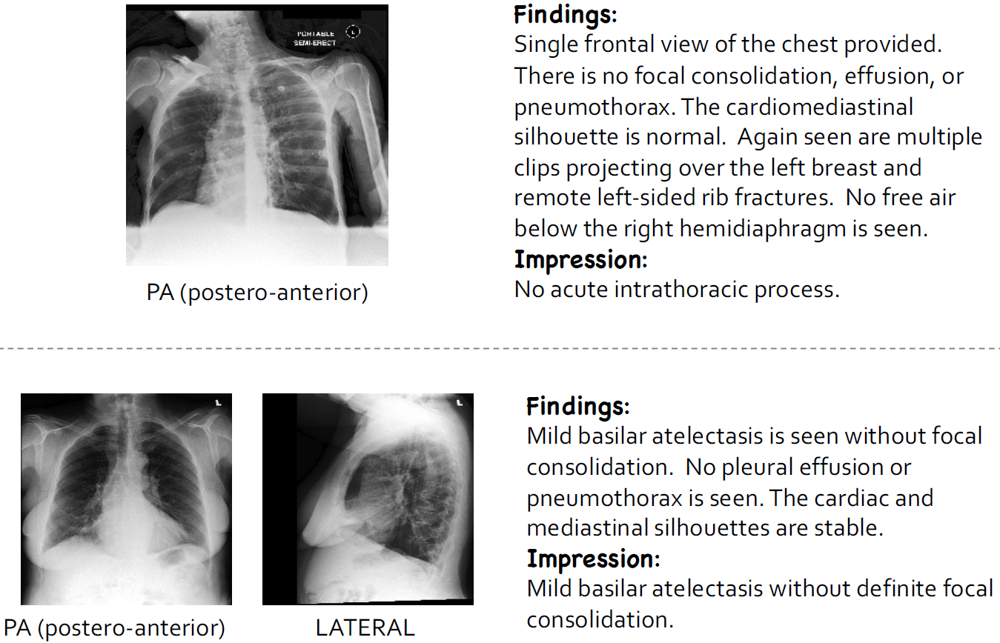
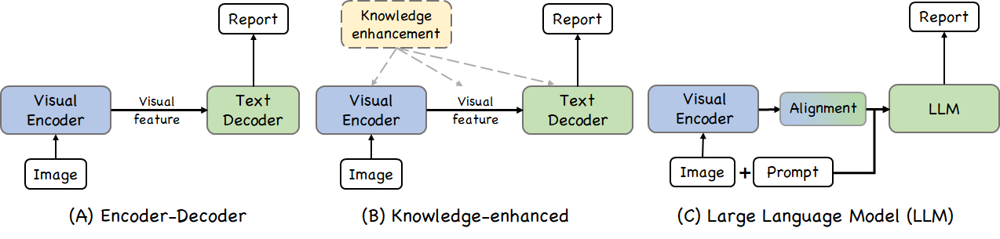

# A Survey on Medical Report Generation: From Deep Neural Networks to Large Language Models

  

# TL;DR
This repository contains a list of papers, codes, datasets in medical report generation (MRG) field. If you found any error, please don't hesitate to open an issue or pull request.

## Background

### Problem Definition

Given a radiology image, the main objective of medical report generation (MRG) is to generate a descriptive medical report as shown in Figure 1.
Current studies leverage medical reports written by professional radiologists as the reference, whose output is expected to be as close to as possible. Formally, they adhere to standard optimization procedures by employing the cross-entropy loss to compare the generated report against the gold standard report.

Figure 1: Two representative cases in MRG, which consist of chest radiology images with their corresponding radiology reports, respectively. Formally, the goal of MRG is to generate the 'Findings' content from one or multiple radiology images.

### Benchmark Dataset

The most widely used datasets are Indiana University Chest X-ray (**[IU X-Ray](https://openi.nlm.nih.gov/faq#collection)**) and MIMIC Chest X-ray (**[MIMIC-CXR](https://www.physionet.org/content/mimic-cxr-jpg/2.0.0/)**). 

1. **IU X-Ray** is a widely-used benchmark in MRG systems, which was introduced by Indiana University. 
It comprises 7,470 chest X-ray images associated with 3,955 radiology reports. Existing MRG studies mostly follow the data splits proposed by [Chen et al.](https://aclanthology.org/2020.emnlp-main.112/), which first exclude the samples without the ``Finding'' section, and partition IU X-Ray into the train, validation, and test sets with the ratio of 70\%, 10\%, and 20\%, respectively.

2. **MIMIC-CXR** is a recently released large-scale benchmark dataset, which is provided by the Beth Israel Deaconess, USA. It includes 377,110 chest X-ray images and 227,835 reports. Formally, the official data splits are widely adopted. Thus, there are 368,960/2,991/5,159 cases for train/validation/test.

### Evaluation Metrics

#### NLG Metrics

To calculate the performance of MRG, the natural language generation (NLG) metrics, i.e., **BLEU-n**, **METEOR**, **ROUGE-n**, and **CIDEr**, are widely used. These metrics measure the match between the generated reports and reference reports annotated by professional radiologists. In detail, NLG Metrics are utilized to measure the descriptive accuracy of predicted reports.

1. **bilingual evaluation understudy ([BLEU-n](https://aclanthology.org/P02-1040.pdf))** is initially introduced for machine translation, which measures the n-gram precision of generated tokens. BLEU-n is usually employed in the evaluation of MRG approaches, with n ranging from 1 up to 4. This metric assesses the accuracy and coherence of the generated reports to a certain extent.

2. **metric for evaluation of translation with explicit ordering ([METEOR](https://aclanthology.org/W05-0909/))** is initially proposed for machine translation, which computes the recall of matching uni-grams from tokens in produced and gold standard reports according to their exact stemmed form and meaning.

3. **recall-oriented understudy for gisting evaluation ([ROUGE-L](https://aclanthology.org/W04-1013/) and [METEOR](https://aclanthology.org/W05-0909/))** is initially designed for summarization, which measures the similarity between the generated and gold standard report based on their longest common subsequence (LCS) tokens.

4. **Consensus-based image description evaluation ([CIDEr](https://www.cv-foundation.org/openaccess/content_cvpr_2015/papers/Vedantam_CIDEr_Consensus-Based_Image_2015_CVPR_paper.pdf))** is initially designed to evaluate the quality of generated descriptions for natural images. In MRG systems, CIDEr evaluates models by rewarding topic-specific terms (terminologies in MRG) and penalizing overly frequent terms.

#### CE Metrics

However, existing NLG evaluation metrics are not tailored to evaluate the accurate reporting of abnormalities in the image, which is the core value and urgent problem of MRG. Thus, additional **clinical efficacy (CE)** metrics are proposed to specifically measure the correctness of descriptions of clinical abnormalities. CE metrics are widely employed to capture and evaluate clinical correctness of predicted reports.

To calculate CE metrics, medical labelers, i.e., **[CheXpert](https://stanfordmlgroup.github.io/competitions/chexpert/)** are utilized to annotate tokens in both generated report and the gold standard one across 14 categories of diseases and support devices, producing the Precision, Recall, and F1 scores.

#### Manual Evaluation

In addition to above automatic metrics, the human evaluation is also conducted in [Liu et al](https://aclanthology.org/2021.acl-long.234/), [Liu et al](https://proceedings.neurips.cc/paper/2021/file/876e1c59023b1a0e95808168e1a8ff89-Paper.pdf) etc. In these works, they invite professional radiologists to rate the quality of generated reports from faithfulness and comprehensiveness perspectives. However, the manual evaluation is both time-consuming and costly given large amount of reports and different radiologists many have conflicted opinion in labeling.

## Taxonomy

Figure 2: Three categories for MRG, including (a) Data-driven Encoder-Decoder based; (b) Medical Knowledge Enhanced, and (c) Large Language Model based frameworks.

## Data-driven Encoder-Decoder based Frameworks

### Typical Encoder-Decoder based Approaches

On the Automatic Generation of Medical Imaging Reports [[paper](https://aclanthology.org/P18-1240/)], [[code](https://github.com/ZexinYan/Medical-Report-Generation)]

Hybrid Retrieval-Generation Reinforced Agent for Medical Image Report Generation [[paper](https://proceedings.neurips.cc/paper_files/paper/2018/file/e07413354875be01a996dc560274708e-Paper.pdf)]

### Customized Encoder-Decoder based Approaches

Show, Describe and Conclude: On Exploiting the Structure Information of Chest X-ray Reports [[paper](https://aclanthology.org/P19-1657/)]

Competence-based Multimodal Curriculum Learning for Medical Report Generation [[paper](https://aclanthology.org/2021.acl-long.234/)]

Automatic Radiology Report Generation by Learning with Increasingly Hard Negatives [[paper](https://arxiv.org/abs/2305.07176)]

Contrastive Attention for Automatic Chest X-ray Report Generation [[paper](https://aclanthology.org/2021.findings-acl.23/)]

AlignTransformer: Hierarchical Alignment of Visual Regions and Disease Tags for Medical Report Generation
[[paper](https://link.springer.com/chapter/10.1007/978-3-030-87199-4_7)]

DeltaNet: Conditional Medical Report Generation for COVID-19 Diagnosis [[paper](https://aclanthology.org/2022.coling-1.261/)]

### Few-shot Learning Approaches

Auto-Encoding Knowledge Graph for Unsupervised Medical Report Generation [[paper](https://proceedings.neurips.cc/paper/2021/file/876e1c59023b1a0e95808168e1a8ff89-Paper.pdf)]

MedCLIP: Contrastive Learning from Unpaired Medical Images and Text [[paper](https://aclanthology.org/2022.emnlp-main.256.pdf)]

## Medical Knowledge Enhanced Frameworks

### Implicit Knowledge based Approaches

Generating Radiology Reports via Memory-driven Transformer [[paper](https://aclanthology.org/2020.emnlp-main.112/)]

Radiology report generation with a learned knowledge base and multi-modal alignment [[paper](https://www.sciencedirect.com/science/article/pii/S1361841523000592)]

### Explicit Knowledge based Approaches

Automatic Radiology Report Generation Based on Multi-view Image Fusion and Medical Concept Enrichment [[paper](https://link.springer.com/chapter/10.1007/978-3-030-32226-7_80)]

When Radiology Report Generation Meets Knowledge Graph [[paper](https://arxiv.org/abs/2002.08277)]

Exploring and Distilling Posterior and Prior Knowledge for Radiology Report Generation [[paper](https://openaccess.thecvf.com/content/CVPR2021/papers/Liu_Exploring_and_Distilling_Posterior_and_Prior_Knowledge_for_Radiology_Report_CVPR_2021_paper.pdf)]

Auxiliary signal-guided knowledge encoder-decoder for medical report generation [[paper](https://link.springer.com/article/10.1007/s11280-022-01013-6)]

Knowledge matters: Chest radiology report generation with general and specific knowledge [[paper](https://www.sciencedirect.com/science/article/pii/S1361841522001578)]

KiUT: Knowledge-injected U-Transformer for Radiology Report Generation [[paper](https://arxiv.org/abs/2306.11345)]

Dynamic Graph Enhanced Contrastive Learning for Chest X-ray Report Generation [[paper](https://arxiv.org/abs/2303.10323)]

## Large Language Model based Frameworks

### Textual LLM based Approaches

ChatGPT makes medicine easy to swallow: an exploratory case study on simplified radiology reports [[paper](https://link.springer.com/article/10.1007/s00330-023-10213-1)]

Translating radiology reports into plain language using ChatGPT and GPT-4 with prompt learning: results, limitations, and potential [[paper](https://vciba.springeropen.com/articles/10.1186/s42492-023-00136-5)]

Evaluating the performance of Generative Pre-trained Transformer-4 (GPT-4) in standardizing radiology reports [[paper](https://link.springer.com/article/10.1007/s00330-023-10384-x)]

Evaluating GPT-4 on Impressions Generation in Radiology Reports [[paper](https://pubs.rsna.org/doi/abs/10.1148/radiol.231259?journalCode=radiology)]

ImpressionGPT: An Iterative Optimizing Framework for Radiology Report Summarization with ChatGPT [[paper](https://arxiv.org/abs/2304.08448)]

ChatCAD: Interactive Computer-Aided Diagnosis on Medical Image using Large Language Models [[paper](https://arxiv.org/abs/2302.07257)], [[code](https://github.com/zhaozh10/ChatCAD)]

ChatCAD+: Towards a Universal and Reliable Interactive CAD using LLMs [[paper](https://arxiv.org/abs/2305.15964)], [[code](https://github.com/zhaozh10/ChatCAD)]

Style-Aware Radiology Report Generation with RadGraph and Few-Shot Prompting [[paper](https://aclanthology.org/2023.findings-emnlp.977.pdf)]

### Multi-modal LLM based Approaches

Exploring the Boundaries of GPT-4 in Radiology [[paper](https://aclanthology.org/2023.emnlp-main.891/)]

RadLLM: A Comprehensive Healthcare Benchmark of Large Language Models for Radiology [[paper](https://arxiv.org/pdf/2307.13693.pdf)]

Radiology-GPT: A Large Language Model for Radiology [[paper](https://arxiv.org/abs/2306.08666)]

Towards Generalist Foundation Model for Radiology by Leveraging Web-scale 2D&3D Medical Data [[paper](https://arxiv.org/abs/2308.02463)]

MAIRA-1: A specialised large multimodal model for radiology report generation [[paper](https://arxiv.org/abs/2311.13668)], [[code](https://www.microsoft.com/en-us/research/project/project-maira/)]
